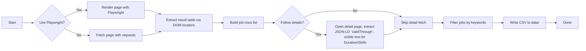

# Architecture Overview

This document describes the high-level architecture of the `job-scraper` project and its components.

## Components

- Scraper (Python)
  - `scraper.py` — main entrypoint, offers both static (requests + BeautifulSoup) and JS-rendered (Playwright) scraping modes; CLI for filters/flags.
  - Parsing modules (within `scraper.py`) extract table rows and optionally follow detail pages to extract `Duration`, `Key Programming & Technical Skills`, and `Deadline`.
  - Output: CSV files saved into `data/`.

- Playwright (optional runtime)
  - Used to render the search page, submit search queries, and paginate through results where JavaScript is required.

- Scheduling / CI
  - GitHub Actions workflows (provided) can run tests and optionally run the scraper on a schedule, upload artifacts (CSV), or commit/update data to a branch.

- Tests
  - `tests/` contains unit tests (pytest) for parsing logic.

## Flow (sequence)

Embedded architecture diagram (SVG):

For quick reference the logical flow is:

Notes:
- The SVG above is included for convenience and renders on GitHub; the mermaid flow is kept for developers who prefer the diagram source.
- The diagram highlights optional branches such as `--follow-details` and the choice between `requests` and Playwright.

## Data model
- Each job row is a dict with keys:
  - `Position ID`, `Position Title`, `Category`, `City`, `Country`, `Duration`, `Key Programming & Technical Skills`, `Deadline`

## Notes on key design choices
- Prefer JSON-LD (`application/ld+json`) `validThrough` for reliable deadline extraction; fall back to visible-text heuristics when absent.
- Playwright is used only when JavaScript rendering/pagination is required; otherwise `requests` + `BeautifulSoup` is faster and simpler.
- `--follow-details` is optional because per-job detail fetches are slow and increase load on the site.

## Security & rate limiting
- Use polite scraping: avoid excessive parallel fetches; add backoff if needed. GitHub Actions scheduler uses a single worker and should be safe for daily runs.

## Where to look in code
- `scraper.py` — primary implementation; see `fetch_with_playwright`, `parse_jobs_from_html`, `parse_job_detail_html`.
- `tests/` — parsing unit tests

