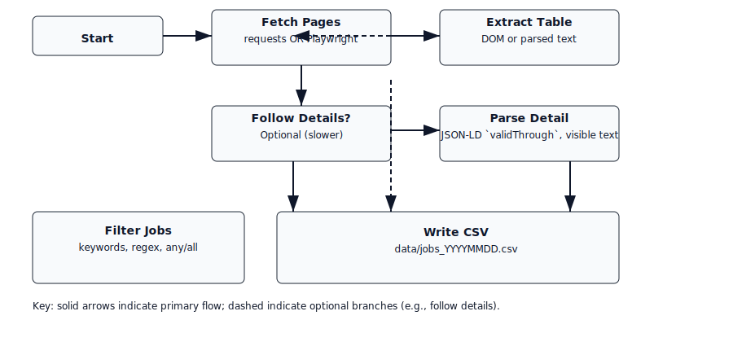

# CGI Careers Scraper — Documentation Site

[](https://github.com/karthiknagaraj/cgi-careers-scraper/actions/workflows/ci.yml)
[](../LICENSE)

A small, focused scraper for CGI career listings that extracts jobs and writes CSV output. This documentation site provides quick access to usage, architecture, developer guides, and contribution information.

---

## Quick Start
- Install and activate Python venv (recommended):
  ```powershell
  python -m venv .venv
  .\.venv\Scripts\Activate
  pip install -r requirements.txt
  ```

- (Optional) Install Playwright browsers for JS-rendered scraping:
  ```powershell
  pip install playwright
  playwright install
  ```

- Run a one-off scrape (first page only):
  ```powershell
  python scraper.py -k "Summer 2026" --max-pages 1 --output data/jobs_$(Get-Date -Format yyyyMMdd).csv
  ```

- See `docs/USAGE.md` for more examples and scheduling notes.

---

## Documentation
- [Overview & Index](README.md)
- [Architecture](ARCHITECTURE.md)
- [Usage & Quickstart](USAGE.md)
- [Developer Guide](DEVELOPER.md)
- [Contributing](../CONTRIBUTING.md)
- [Changelog](../CHANGELOG.md)

---

## Features
- Supports both `requests` + BeautifulSoup and Playwright for JS pages
- Optional detail-page scraping (`--follow-details`) to extract Duration, Skills, and Deadline
- Deadline extraction prefers JSON-LD `validThrough` when present
- CSV output, unit tests, CI, and scheduled GitHub Action to run scrapes daily

---

## Architecture (visual)


## GitHub Pages
This repository includes an automated GitHub Action that publishes the `docs/` folder to GitHub Pages when changes are pushed to `main`.

If you'd like the site visible at `https://karthiknagaraj.github.io/cgi-careers-scraper/` I can enable GitHub Pages setting for the repo or you can enable it via the repo Settings → Pages → Source → `gh-pages` branch or `docs/` folder (depending on preference).

---

## Support
Open an issue using the templates in `.github/ISSUE_TEMPLATE.md` and tag it with `help wanted` if you need assistance.
